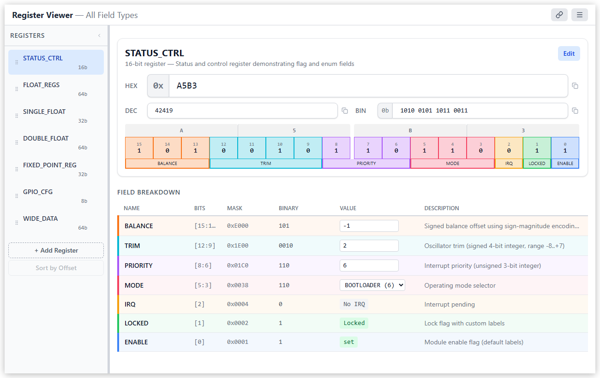
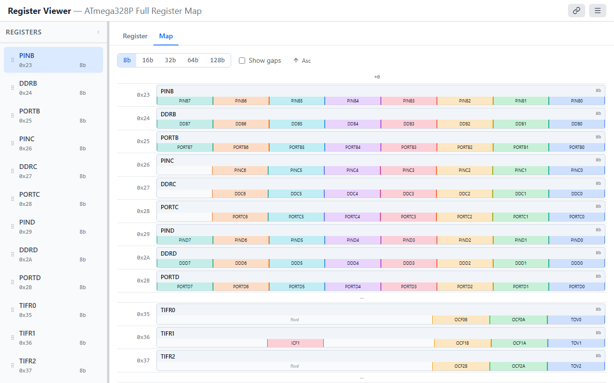

# Register Viewer

An interactive web tool for decoding and encoding hardware register values. Define your register field layouts once, then enter any raw value to instantly see it broken down into named fields — or edit fields and watch the raw value update in real-time.

**[Try it live at registerviewer.com](https://www.registerviewer.com/)**

  <picture>
    <source media="(prefers-color-scheme: dark)" srcset="docs/images/screenshot-dark.png">
    <source media="(prefers-color-scheme: light)" srcset="docs/images/screenshot-light.png">
    
  </picture>

## Quick Start

1. Visit **[registerviewer.com](https://www.registerviewer.com/)** — no install or account required for local editing
2. A sample 16-bit `STATUS_CTRL` register is pre-loaded so you can explore immediately
3. Try clicking bits in the grid, changing the hex value, or editing field values in the table

More examples are available from the menu (**Examples**). You can also open these directly:

- [ATMega328P Timer/Counter 0](https://www.registerviewer.com/#data=eJzNV12P2joQ_SuWn6gEmw92gfIWQkBogawg6laqqiokBtxN7CgxcK9W-99rJ8QkaWiBbaU-RfZ4POeMz4ydV7hHcYIpgX2tCWO0wQnjE7D_5RUSN0SwDx3TXKgGbMID9tkW9ntN6KPEi3HEUj_o4BDFikl3hLuqwKSExTQAi-NmQPjS9TpBDPY73HuNUeCXQjyPZ-oXra9-5SvDZJViCcRXrcZ6dvdoTeMQjBFBsStmwYz6CKwwS0C6B2h4NFxhgsABsy0Qe-sAE5DyGHzgIdj_kYiKOd4NivlEgjcE-QQlHBXckWwI35oSoGnP1EEO7uEI7r4KzqRh5MYI2DsW7ViGi4MF5tYlBAVgABqEktbT86yAApFdyEfiY_HEYZRlZu8GO5Qm4AhhOFma9nxumY41TKEdV2hyhWOPx1OraNOlzZxaxqJoakvT0nLg29cKWSMn2z2S7VxL1viXyRbpZrp4h74HRX1_rNO3uVTzfOrnlG0G1HsBSxQgj4FGFHOjG6D4huQtHfvp6VzezOmjop1L26PSq0-bMHXui7b7kk1_6BSND-Vwql5y7Uir9dn5NjKm08l8XFzQLS1YTJapvXhmaVHnKW0fU9q-plkAvaZPZP0j7xVGIffrwN3wkfhM3RUKeOpfoRcgN-ZGcbjp6UOe2QLKkW2eukbnXCGNaOzJMsqranBh6DkFqb9EkI2qKH4q5-5FKIz3oijX2dxRLy8zWV6NXkucl5cZQKqRD4WS66p1JZdHK7H-qegqMTP9XX5BFOnZ192SlUzXXpZdrY5ZHujXzCr7p8zS_uzl_fkdPK_olud4FptmVz_Hc_B-noMbeTqT2fLxCr1OxCfeRfwqdJMXSbRAU9PqlWpPLKlU9UKl2vzZtg7ooRDWIu4qQBdW7BAnYrUvKzbz9kudwzY5Mim1_E2m_eYIDJ4A5m3_PjIpjvxO1X-DbPDXkJWFM1rcpJsRj1qnm4d2vWw-3a6aUcbzwt6eu0nicqJ8JqPbxXIdoNRHoslGVSg3q-NPQOEvzNPf1CfRk1K_468UfzH8J87u-PI8DcWVlY_s0lK7vDLrTaehUFw2emvCKKbf-SNSBGSYBaiqA9AwnBBt3LbeexIX6S8l4xIflKY0IP8SwTqmIWBbfoxyQxBiL6Ze9kbm79c7HiDA5IXvvGUsSvqKcjhod9mqLY7u-CNM8emBBNT1EwURZYj22END6ikGC1HQ6vY0tWXsGA0pw3vUmpUDJK1T8G9Dl7nJFiF2F_lrfg4_AJvkvy0)
- [ADS1015 I2C Registers](https://www.registerviewer.com/#data=eJy1V91u4jgUfhUrNzsrhZCEn7ZIe8EAbZEY6AJldjWqkEkc4hmTZGNTWlWV9iH2CfdJ9tgQ4gSYbhnNDSj-ju1zznd8fl6MR5JyGkdGyzGNlCwpF7BgtL68GBFeEaNldOIokzGNDfVFCLJN0_AJ91KaCLVZk0Lj3Sno37__QV4cCUwjjkRIUEr4mgkUB-qLYS4knu2jEVrQCKfPSGziX3jFi1cJIysSCRTE6QoL9MFxKwsqTMRIICpf11zQgBL_Vws0i4OAE2G0bNOANeYXbBj3Jr3xrNcFuRVfGK2aaTD5b5fNaLMNfuagKPY5WmDvG7JD2CSeE3kMjQRZkhQWOF1GxI8Ih2uMdbT9NF7N_Y3dL47Tsh-yC53G7sZ6-catSbofdl76oLyAci8cmH2o2OuDpgJQEtDlG6SBxCFhacw4ihOSYkGjJVrFPjGBnmQtECeMeHK7iXwsMAIRwII1YxXuYQYc42gJKzjyleoYBOJUHcEtuAk4Qr8h--mycVnTaXOO0dYZfbqb_37f23vxFG2d_Ka_1mRN1PU-5XjBiIU-hyRC8mIRI8cxVfBpulGeifpqX3vQG0-r4-6fEgnpMqzQVUJ8HHnEyl1OovUKvuRfDzxGyVbzR8zWRGm4s6F9Pe2N546KjR3olEBXB90SWNfB2h7s9iftjwOI6CLl0mGD9jRzmLtzmFt22AALL5Tc5n6wUCejfhMS8FGqeSKBx8nkHsIRDmSsLIjcjjknqSD-GY4ZjoZS1c5tf3hz3Ds5emDj3WhQfsu17wRFEjOcUvGs2SiDIFvOMlLB3nO47kz7s958MPp8gu4tftu_uT1i06dRdx_p9VPpolN8U8ogeMNrSBp6TGMwMMU-lbswQ7CyoZEfb3S-32_fdNzu9qf90bA9OG7g5_6wK43XbeuOM6MudkY1ykZ1s0wiX6lKOR84lmmPI0hCsAhJaZvl36mw415O7ibHdXUbdgnLn179qozlL-_KLWP1_L6mXQYb-YX1A7C5B2u1A_CiDMpEoXtWD5jLnW8vD3xLHqlHStn8DFd2RsNpf3g_uj_hzgk81EFvPrkdTYta3t209_k7S-BXZS3v0niZ4tVKZmG0hIYBSf5lmUsPiossUSrksdx8hinXk_G8aTn1-uy4KRKvW_ZVc3Y8OiTuWnb9cnY8QiTuWLZbPL9ewG2r4biz44Gyxd1G8f7mEbxYOi6OSdRKMXP_x56NLMk4B-Whr2r9CtoQCq_wCUgo-hxNVBsgC2cQkBSaE7rNMhwijJEKiXwoptuOwQtxFBHGz8mn_aE9h59T1XMH107UT9h4ANd02D2A68XDb4bd4xSps0tos3h0Cb3Q0doW1YkZTQ56RecgUY62r1jldC6wWHNUzXzOw7jQRgKeCmh-oMCRFnKg61Irmojsx7DfQjZg21WZIEwlS32mZ4mAYdlJyr8BXgCbRuvF8BjB6b73V8mlioYxIhATnpBdsuzsjD4cBcCkdLvxWrB_EM9FCFUs_F7DOoAKNlVSMfOLfSuLNypM9yVQ7OUgm7x7otBbVdu29VbV_aEJQ56bPhIfWmR91jhzzNC99sagIX2X-0RFZW5-edZ4a7a4pf-DrVvonU_RtU6Sn0TXxfX1tU5X7WfQdX0eXbrb3qBLOe8H-XrIR_qZ3K9erTbPtwz7yYadu0lRfsq5DFbyuFKL8AJgMddeLl4EQQC2GUkaf5XPHY4WVDCV4boTx3YaCLT9CLNtu9sxyuZNyRP0qP2Ii3QtDeAo2wRFJ8UVvsKMmfJVVxL5sk20G5ThMOhlRYj6bgdJW9MAezBwQpthIqhu29Ez0fuJYs_LaPQNFAiFSHirWt1sNpagFshUGRVVn1f580rKVIFnqZCV-MpO7PtgO7-PqACjuAz41_8A_fyYgw)

## How It Works

1. **Define registers** — give each register a name, bit width, and optional memory offset
2. **Add fields** — map bit ranges to named fields with types like flags, enums, integers, floats, or fixed-point
3. **Enter a value** — type a hex, decimal, or binary value and see every field decoded instantly
4. **Edit interactively** — click individual bits, toggle flags, pick enum values, or type field values directly

All edits are bidirectional: changing the raw value updates the fields, and changing a field updates the raw value.

## Features

- **Any register width** — 8, 16, 32, 64-bit, or any arbitrary width up to 128 bits
- **Multiple registers** — define a collection of registers and switch between them in the sidebar
- **Rich field types**:
  - **Flags** — single-bit on/off with custom labels
  - **Enums** — multi-bit fields with named values (e.g., `0 = OFF, 1 = STANDBY, 2 = ACTIVE`)
  - **Integers** — signed or unsigned, any width
  - **IEEE 754 floats** — half, single, and double precision
  - **Fixed-point** — Qm.n notation with configurable integer and fractional bits
- **Clickable bit grid** — toggle individual bits visually, color-coded by field
- **Register map view** — see all registers laid out by memory offset with configurable table widths
- **Drag-and-drop reordering** — rearrange registers in the sidebar, or sort by offset
- **GUI and JSON editor** — define fields via a visual form or edit raw JSON for power users
- **Cloud save and share** — sign in by email to save projects to the cloud and publish unlisted short links
- **Snapshot URLs** — share small projects as self-contained compressed URLs with no server dependency
- **Import/export** — save and load register definitions as JSON files
- **Multiple projects** — manage separate register sets as independent projects
- **Dark and light theme**
- **Keyboard accessible** — full keyboard navigation with screen reader support

## Register Map

When registers have memory offsets, the **Map** tab shows all registers laid out by address — useful for visualizing a peripheral's register file at a glance.

  <picture>
    <source media="(prefers-color-scheme: dark)" srcset="docs/images/map-view-dark.png">
    <source media="(prefers-color-scheme: light)" srcset="docs/images/map-view-light.png">
    
  </picture>

## Documentation

- **[User Guide](docs/user-guide.md)** — detailed walkthrough of all features
- **[Developer Guide](docs/DEVELOPMENT.md)** — local setup, testing, and project structure
- **[API Reference](docs/API.md)** — REST API for the cloud save/share backend
- **[Deployment Guide](docs/DEPLOYMENT.md)** — production deployment and CI/CD

## Contributing

Contributions are welcome! See the [Developer Guide](docs/DEVELOPMENT.md) for local setup and project structure.

## AI Content Disclosure

This project has been developed with heavy use of AI coding tools (Anthropic's Claude Code in particular). I am an Electronics Engineer by trade, and though I have a solid amount of software development experience, none of that experience is in web-app / frontend / fullstack domains.

I started this project as a test to see how "vibe coding" or "agentic AI development" works, and deliberately picked something in a domain I have little familiarity with. When I was pleased with the initial results, I decided to polish it into something releasable. Almost all of the codebase has been developed, reviewed, and iterated on using AI tools. I have only given high-level direction - add this feature, fix that bug, and so on. While I have reviewed the content of most commits, and have a reasonable understanding of the codebase, I have written virtually zero code myself.

Overall, I am impressed with the result, and I would say that, through this project, my opinion on AI-assisted development has gone from sceptical to supportive.

## License

MIT
